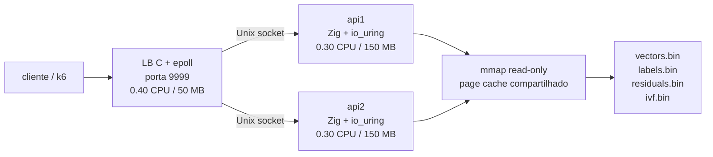
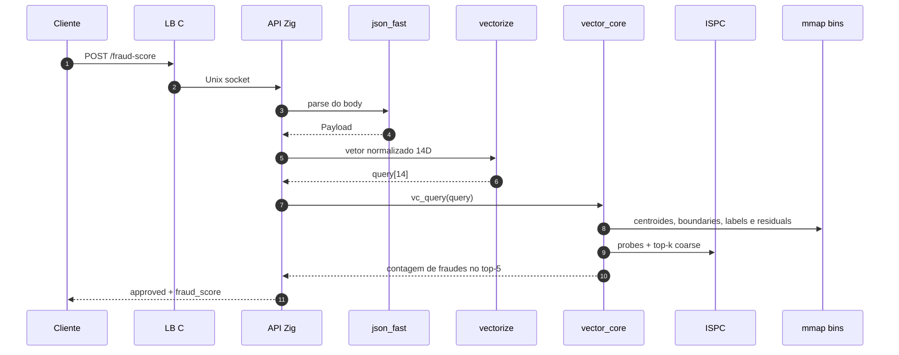
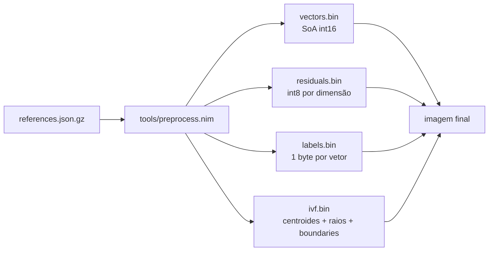
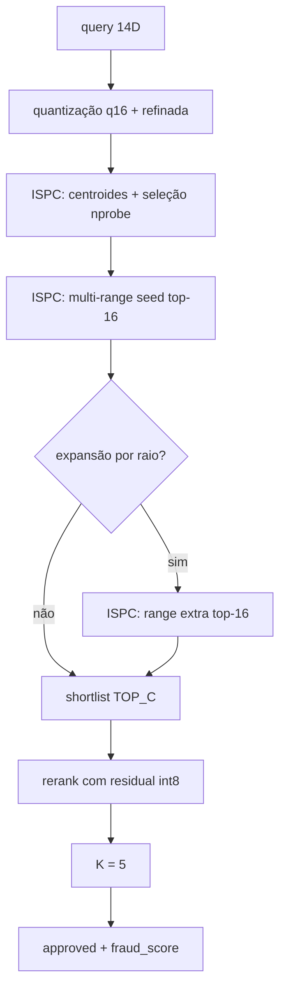
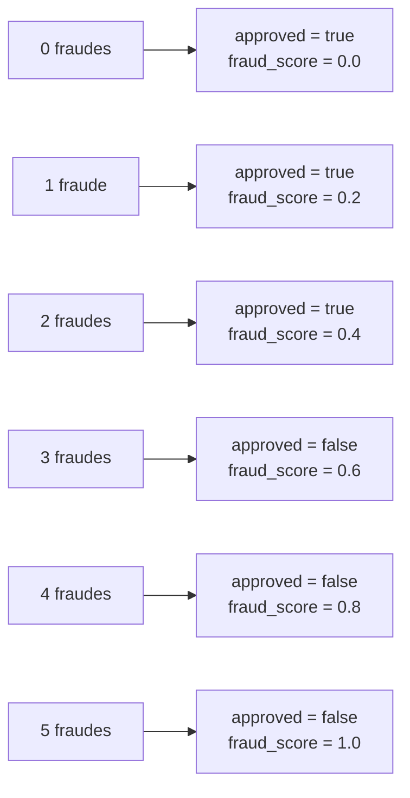

# Documentação Técnica

Este documento resume a arquitetura, o pipeline de dados e o hot path da busca vetorial desta submissão para a Rinha de Backend 2026.

## Topologia

Orçamento total: `1.0 CPU` e `350 MB`.

O load balancer é um proxy C mínimo com `epoll`, round-robin e backend via Unix sockets. As APIs rodam um worker de I/O cada (`IO_BACKEND=uring`, `HTTP_THREADS=1`), evitando contenção dentro do limite de `0.30 CPU` por instância.

## Fluxo da Requisição

Endpoints:

- `GET /ready`
- `POST /fraud-score`

## Componentes

| Arquivo | Responsabilidade |
| --- | --- |
| `lb/lb.c` | load balancer C com `epoll`, round-robin e Unix sockets |
| `src/main.zig` | startup, carregamento dos bins, listeners TCP/Unix e seleção do backend de I/O |
| `src/io_server.zig` | servidor `io_uring` usado no caminho da competição |
| `src/dispatch.zig` | parsing HTTP, roteamento e instrumentação opcional de profiler |
| `src/json_fast.zig` | parser JSON manual sem heap allocation no hot path |
| `src/vectorize.zig` | normalização das 14 features da transação |
| `src/vector_core.zig` | consulta IVF, expansão por raio, shortlist e rerank refinado |
| `src/knn.ispc` | kernels SIMD AVX2 para probes, ranges e top-k coarse |
| `tools/preprocess.nim` | geração dos arquivos binários usados em runtime |

## Pipeline de Dados

Comportamento do build:

- por padrão, `USE_LOCAL_DATA=1` reaproveita `data/*.bin` quando os arquivos existem;
- sem dados locais, o build baixa `references.json.gz` do repositório oficial e gera os bins;
- o ISPC compila `src/knn.ispc` com `--target=avx2-i32x8`, `--cpu=haswell` e `--opt=fast-math`;
- o Zig linka o objeto ISPC via `-Dispc-object=/tmp/knn_ispc.o`.

## Hot Path da Busca

O índice usa IVF quantizado com shortlist coarse e rerank refinado:

1. a query 14D é quantizada para `i16` e também para a escala refinada;
2. `vc_centroid_dists_top_soa_ispc` calcula as distâncias dos centroides em layout SoA e seleciona os `nprobe` clusters na mesma passada;
3. `vc_scan_ranges_top_q16_ispc` varre todos os clusters seed em uma chamada e retorna o top-16 global coarse;
4. quando necessário, a expansão por raio varre clusters extras com `vc_scan_top_q16_ispc`;
5. os `TOP_C` candidatos passam por rerank usando `residuals.bin`;
6. o top-5 final define `fraud_score`.

A principal mudança de performance foi evitar materializar distâncias demais e evitar top-k escalar em Zig no caminho seed. O kernel ISPC agora devolve apenas os melhores candidatos coarse relevantes.

## Parâmetros Atuais

| Parâmetro | Valor | Onde |
| --- | --- | --- |
| Dimensão do vetor | `14` | `src/vectorize.zig` / `src/vector_core.zig` |
| `K` final | `5` | `src/vector_core.zig` |
| Shortlist coarse | `TOP_C = 16` | `src/vector_core.zig` / `src/knn.ispc` |
| Clusters IVF | `8192` | `Dockerfile` |
| `nprobe` | `8` | `Dockerfile` / `data/ivf.bin` |
| Amostra do k-means | `65536` | `Dockerfile` |
| Iterações do k-means | `25` | `Dockerfile` |
| API workers | `1` por API | `docker-compose.yml` |
| API CPU | `0.30` por instância | `docker-compose.yml` |
| LB CPU | `0.40` | `docker-compose.yml` |
| ISPC target | `avx2-i32x8` | `Dockerfile` |
| CPU target Zig | `haswell` | `Dockerfile` / `build.zig` |

Detalhes relevantes:

- `vectors.bin` usa layout SoA em `i16`, organizado por cluster;
- `centroids_soa_buf` é montado no startup para evitar gathers no scan de centroides;
- `scratch_*` global é seguro porque cada container usa um worker HTTP;
- `mmap` faz pre-fault das páginas no startup para reduzir latência fria;
- o profiler compila para no-op no build normal e só é ligado por `make profile`.

## Vetorização

As 14 features combinam sinal transacional, contexto temporal e perfil do merchant:

- valor, parcelas e relação entre `amount` e `avg_amount`;
- hora do dia e dia da semana;
- minutos desde a última transação e distância da última transação;
- distância de casa e volume nas últimas 24h;
- flags `is_online`, `card_present` e merchant conhecido;
- risco por MCC e ticket médio do merchant.

As saídas seguem a maioria simples no top-5:

## Trade-offs

- O parser manual e a resposta pré-formatada reduzem latência, mas assumem o contrato de payload da competição.
- O IVF com expansão por raio é mais caro que uma ANN agressiva, mas preserva acurácia perfeita no teste oficial local.
- A seleção top-k dentro do ISPC reduz tráfego de memória e trabalho escalar no Zig, ao custo de kernels mais específicos.
- O uso de Unix sockets reduz overhead entre LB e APIs, mas acopla a stack ao ambiente Linux da competição.
