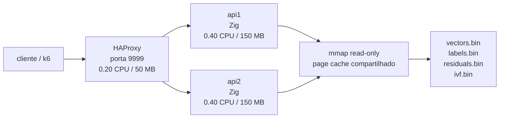
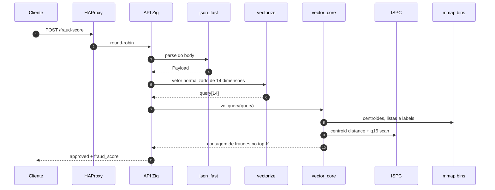
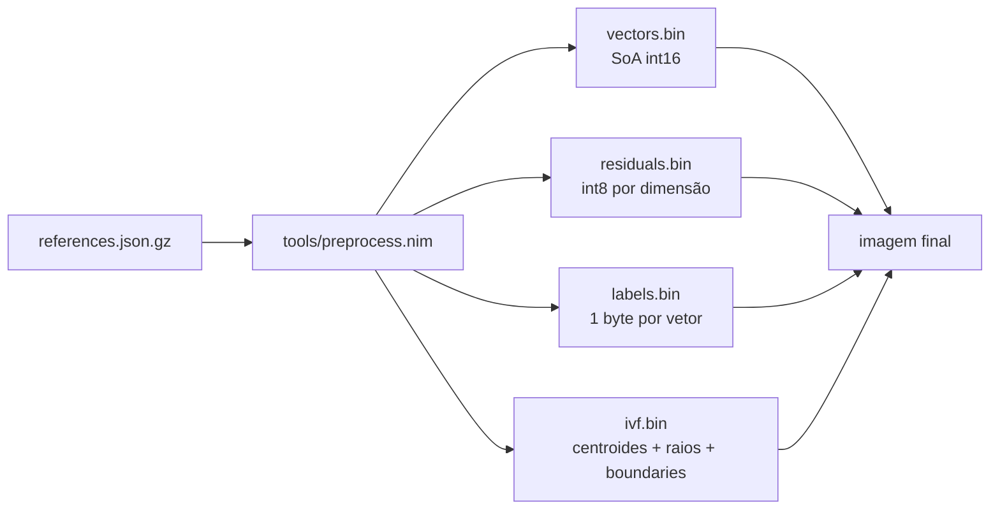
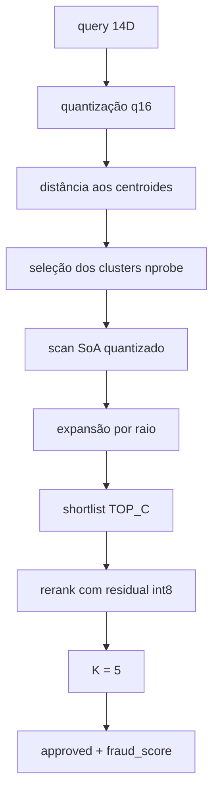
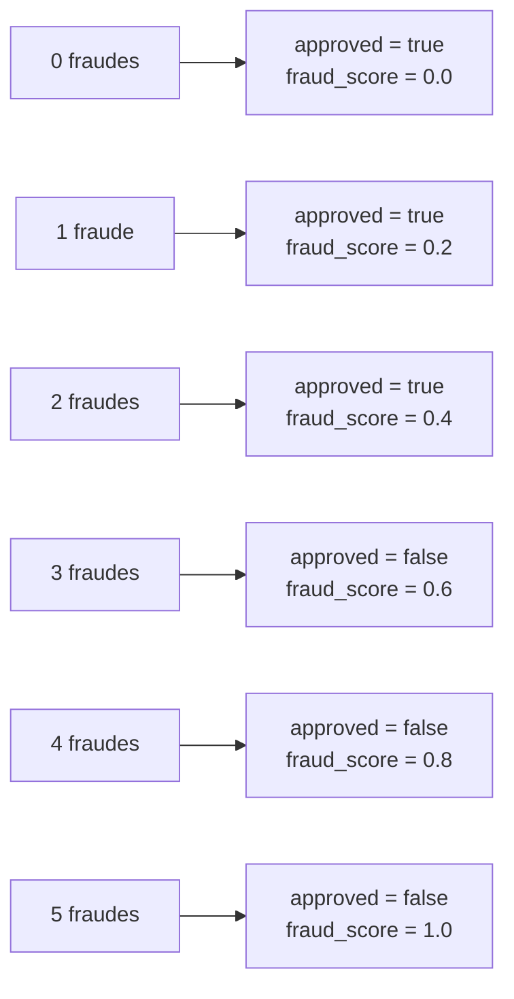

# Documentação Técnica

Este documento concentra os detalhes de arquitetura, preprocessamento e hot path da busca vetorial.

## Topologia

Orçamento total da composição atual: `1.0 CPU` e `350 MB`.

## Fluxo da requisição

O servidor expõe dois endpoints:

- `GET /ready` para readiness depois do carregamento dos binários.
- `POST /fraud-score` para classificar a transação.

## Componentes principais

| Arquivo | Responsabilidade |
| --- | --- |
| `src/main.zig` | servidor HTTP, roteamento, carregamento dos bins e montagem da resposta |
| `src/json_fast.zig` | parser JSON manual sem alocação no hot path |
| `src/vectorize.zig` | vetorização de 14 features e regra final `approved/fraud_score` |
| `src/vector_core.zig` | consulta ao índice IVF, shortlist coarse, expansão por raio e rerank refinado |
| `src/knn.ispc` | kernels SIMD para distância a centroides e scan q16 |
| `tools/preprocess.nim` | geração do índice binário no build da imagem |

## Pipeline de build e dados

Comportamento atual do build:

- por padrão, o `Dockerfile` baixa `references.json.gz` do repositório oficial e regenera o índice;
- se `USE_LOCAL_DATA=1` e os arquivos em `data/*.bin` existirem, a imagem reutiliza os binários locais;
- a compilação usa `-Dcpu=haswell` e linka `knn_ispc.o` com `-Dispc-object`.

## Índice vetorial

O índice combina coarse search com refinamento curto:

1. a query é quantizada para `i16`;
2. o core mede a distância para todos os centroides IVF;
3. os `nprobe` clusters mais próximos são varridos primeiro;
4. a shortlist coarse é expandida quando o raio de um cluster ainda permite um candidato melhor;
5. os melhores candidatos passam por rerank com `residuals.bin`.

Esse desenho reduz o número de vetores escaneados sem abrir mão do refinamento fino nos casos em que o coarse sozinho empata ou fica perto de empatar.

## Parâmetros atuais

| Parâmetro | Valor atual | Onde |
| --- | --- | --- |
| Dimensão do vetor | `14` | `src/vectorize.zig` |
| `K` final | `5` | `src/vector_core.zig` |
| Shortlist coarse | `TOP_C = 16` | `src/vector_core.zig` |
| Clusters IVF | `8192` | `Dockerfile` |
| `nprobe` | `8` | `Dockerfile` |
| Amostra do k-means | `65536` | `Dockerfile` |
| Iterações do k-means | `25` | `Dockerfile` |
| Worker threads na stack | `2` por API | `docker-compose.yml` |
| CPU target | `haswell` | `Dockerfile` / `build.zig` |

Detalhes relevantes da implementação:

- `vectors.bin` usa layout SoA quantizado em `i16`, organizado por cluster;
- `residuals.bin` guarda um ajuste `int8` por dimensão para o rerank refinado;
- `ivf.bin` contém magic, metadados, centroides, raios e limites das listas invertidas;
- o `mmap` faz pre-fault das páginas no startup para reduzir latência fria.

## Vetorização

As 14 features combinam sinal transacional, contexto temporal e perfil do merchant:

- valor, parcelas e relação entre `amount` e `avg_amount`;
- hora do dia e dia da semana;
- minutos desde a última transação e distância da última transação;
- distância de casa e volume nas últimas 24h;
- flags `is_online`, `card_present` e merchant conhecido;
- risco por MCC e ticket médio do merchant.

As saídas seguem a regra de maioria simples sobre o top-5:

## Trade-offs

- O parser manual evita DOM JSON e heap allocation por request, mas aumenta a rigidez do contrato de entrada.
- A expansão por raio custa mais do que uma ANN agressiva, mas melhora a chance de manter o top-K correto.
- O refinamento com residual adiciona memória ao dataset, porém reduz erro de ordenação nos casos de borda.
- O uso de `mmap` read-only simplifica o startup da aplicação e deixa o kernel compartilhar páginas entre `api1` e `api2`.